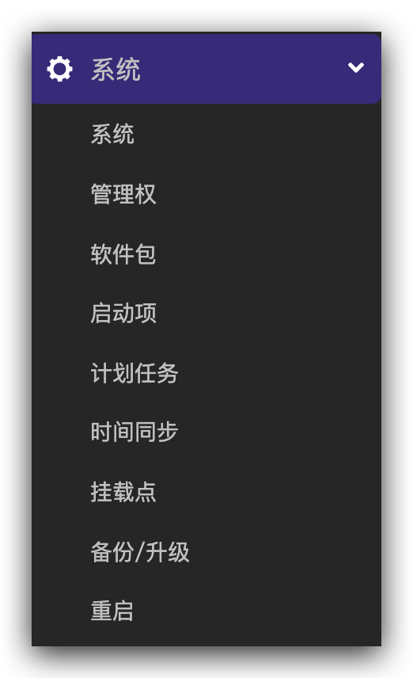
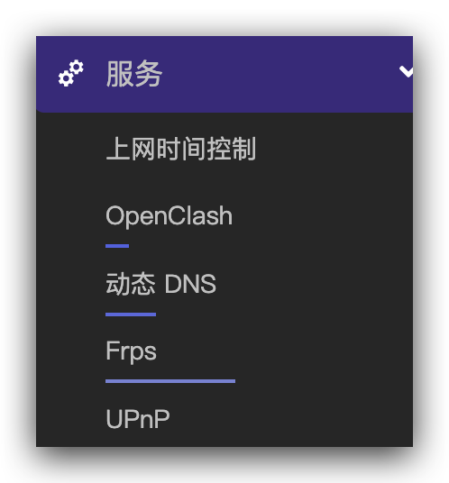
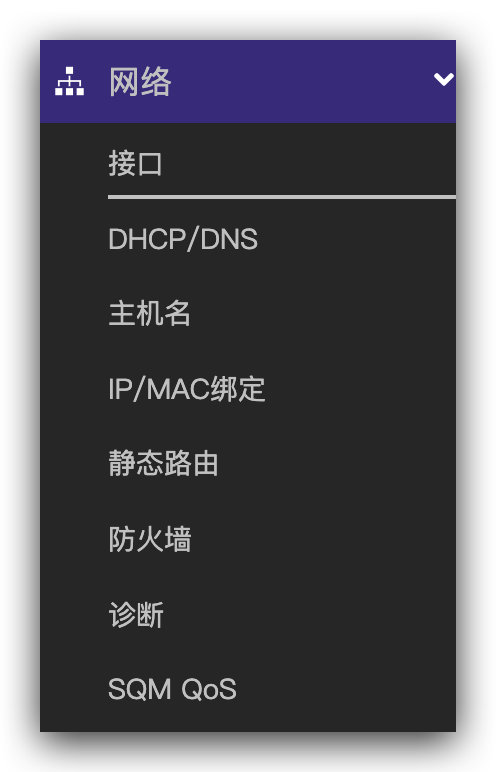

# Actions-OpenWrt

## 版权：

请随便享用，感谢[P3TERX](https://github.com/P3TERX/Actions-OpenWrt) 提供模版

## 修改功能列表：

- [x] push代码自动编译
- [x] 集成微信编译通知
- [x] 修改默认静态管理ip为10.10.10.99
- [x] 修改Host Name
- [x] 生成pve镜像，用于pve上进行测试
- [x] 集成openclash
- [x] 更新argon主题为最新版&设置为默认主题

## 页面功能列表

